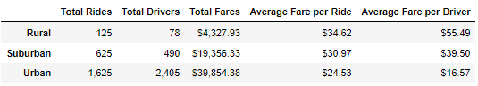
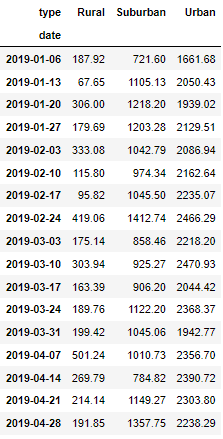
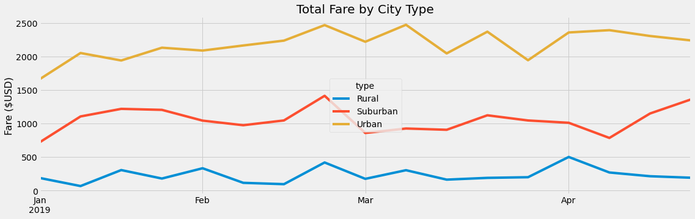

# PyBer Analysis
    
## Overview of the analysis

This work is dedicated to analyze the ride-sharing data by city type. Initial data is provided in two files - city_data containing a list of cities with their types and a count of drivers in each city; and ride_data containing information of completed rides in each city for a specific period of time and ride's fare. As a result of the analysis, we created a summary DataFrame and a multiple-line graph that shows the total weekly fares for each city type.

## Results

From a below PyBer Summary we can see that ride-sharing is more popular in urban areas - they account 1,625 rides or 68.4% of total rides. Suburban areas are on the second place with 625 rides (26.3%) and rural areas have only 125 rides (5.3%). The largest number of drivers also observed in urban areas and the least - in rural. It is cheaper to use ride-sharing in urban areas with an average fare of $24.53 per ride vs in rural areas $34.62 per ride. But even though fare per ride is less in urban areas PyBer got the highest profit here because of the large quantity of rides.

In the below table we can see the total fare per each city type on a weekly basis for a period from January 2019 till end of April 2019. It is informative but not good for data visualization.

Based on above mentioned DataFrame below multiple-line graph was created where we can see dynamic of total fare by city type on a weekly basis. 

## Summary

Low fare doesn't mean low profit as we can see on the Urban areas results, but only if we have a lot of rides. Since urban areas are more popular for using ride-sharing it is possible to increase fare per ride at least for those cities where it is much less than the average of $24.53. 

Suburban areas are showing mid-results overall. To improve them it is a good idea to increase total drivers count - this will increase the area coverage for ride-sharing services and will improve its popularity, which will bring more rides.

For rural areas it is important to decrease fare per ride - high fare could be one of factors that make a negative impact for ride-sharing popularity. Also, it is critical to increase total drivers count. Low area coverage could also negatively affect counts of rides and also high fare per ride.